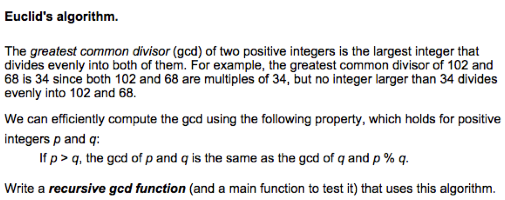

# Scientific Programming with 

## Programming Exercise 13 - Finding the GCD Recursively

** Reminder -  ** you learn by *doing* not watching.  Do this program yourself first!  Then watch how I did it!

### Solution Video

### Solution Code
[pe13.py](pe13.py)

